# Guide de formation complet — Academy Guinéenne

**Public** : administrateur d'établissement (Directeur / Admin) qui configure sa plateforme, et formateur interne / support client qui accompagne les clients.

**Portée** : les 5 types d'établissement pris en charge par la plateforme — École primaire, Collège, Lycée, Université / Grandes écoles, Centre de formation.

**Note sur les illustrations** : les images de ce guide sont des **schémas illustratifs** (mockups dessinés reproduisant fidèlement la disposition des écrans décrits), et non de vraies captures d'écran de l'application — l'outil de capture n'était pas disponible au moment de la rédaction. Chaque illustration porte un bandeau « ILLUSTRATION SCHÉMATIQUE ». Voir l'Annexe C pour les remplacer par de vraies captures plus tard.

---

## Sommaire

1. [Les 5 types d'établissement et leur terminologie](#1-les-5-types-détablissement-et-leur-terminologie)
2. [Créer son compte et son établissement (inscription)](#2-créer-son-compte-et-son-établissement-inscription)
3. [Onboarding guidé (4 étapes obligatoires)](#3-onboarding-guidé-4-étapes-obligatoires)
4. [Le tableau de bord](#4-le-tableau-de-bord)
5. [Structure académique — l'ordre hiérarchique à respecter](#5-structure-académique--lordre-hiérarchique-à-respecter)
6. [Gestion académique quotidienne](#6-gestion-académique-quotidienne)
7. [Planification](#7-planification)
8. [Présences](#8-présences)
9. [Finances](#9-finances)
10. [Apprentissage](#10-apprentissage)
11. [Vie étudiante](#11-vie-étudiante)
12. [Communication](#12-communication)
13. [Administration](#13-administration)
14. [Checklist de mise en route par type d'établissement](#14-checklist-de-mise-en-route-par-type-détablissement)
15. [Annexes](#annexes)

---

## 1. Les 5 types d'établissement et leur terminologie

À la création du compte, vous choisissez un **type d'établissement**. Ce choix ne se limite pas à une étiquette : il change automatiquement le vocabulaire utilisé partout dans l'application, pour que l'interface parle le langage de votre métier.

| Type choisi à l'inscription | Vocabulaire utilisé dans toute la plateforme |
|---|---|
| École primaire | Élève · Classe · Matière · Trimestre · Niveau · Coefficient |
| Collège | Élève · Classe · Matière · Trimestre · Niveau · Coefficient |
| Lycée | Élève · Classe · Matière · Trimestre · Niveau · Coefficient |
| Centre de formation | Élève · Classe · Matière · Trimestre · Niveau · Coefficient |
| **Université / Grandes écoles** | **Étudiant · Groupe / Amphi · Unité d'Enseignement (UE) · Semestre · Niveau/Année · Crédits (ECTS)** |

En résumé, il n'existe que **deux familles de vocabulaire** : « scolaire » (École primaire, Collège, Lycée, Centre de formation) et « enseignement supérieur » (Université / Grandes écoles). Ce guide utilise systématiquement la notation **Terme scolaire / Terme université** partout où le mot change, par exemple **Classe / Groupe**.

Tout au long de ce document, un encart signale les étapes qui diffèrent réellement entre les deux familles :

> 🎓 **Spécifique Université** — ce qui change uniquement pour les établissements d'enseignement supérieur.

---

## 2. Créer son compte et son établissement (inscription)

URL publique : `/inscription`

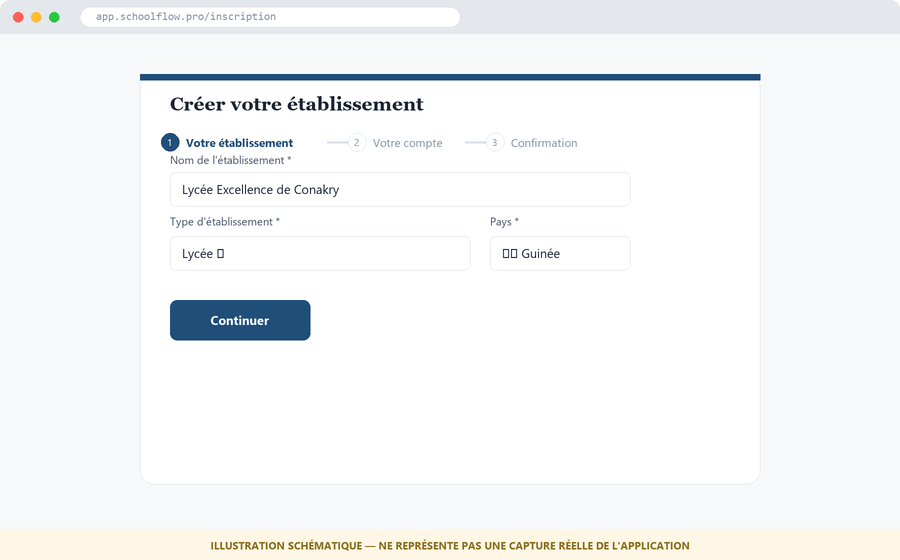
*Étape 1 du formulaire : nom de l'établissement, type (menu déroulant des 5 types), et pays. Le fil d'Ariane en haut confirme qu'il reste 2 étapes avant la création effective.*

L'inscription se fait en **3 étapes**, affichées en haut de la page (Votre établissement → Votre compte → Confirmation). Il est impossible de sauter une étape.

### Étape 1 — Votre établissement
1. **Nom de l'établissement** — texte libre, ex. « Lycée Excellence de Conakry ». Il sert de nom d'affichage partout (en-tête, bulletins, reçus).
2. **Type d'établissement** — menu déroulant, choisir parmi : École primaire, Collège, Lycée, Université / Grandes écoles, Centre de formation. **Ce choix est structurant : il détermine la terminologie (§1) et ne devrait pas être changé après coup** sans accompagnement du support.
3. **Pays** — pré-rempli 🇬🇳 Guinée.
4. Cliquer **Continuer**.

### Étape 2 — Votre compte
Renseigner l'identité du premier administrateur (vous) : prénom, nom, email, mot de passe. C'est ce compte qui deviendra **Administrateur de l'établissement (TENANT_ADMIN)** — le rôle avec tous les droits sur cet établissement.

### Étape 3 — Confirmation
Récapitulatif, puis validation. À la validation :
- L'établissement est créé avec un **essai Pro gratuit de 30 jours, sans carte bancaire**.
- Un **slug** unique est généré à partir du nom (ex. `lycee-excellence-conakry`) — c'est l'identifiant dans l'URL de votre espace : `https://votre-domaine/{slug}/admin`.
- Vous êtes connecté automatiquement et redirigé vers l'**onboarding** (§3). Il n'y a **jamais** de retour en arrière possible vers l'écran d'inscription une fois l'établissement créé — toute correction se fait ensuite dans *Administration → Paramètres*.

---

## 3. Onboarding guidé (4 étapes obligatoires)

L'onboarding s'affiche automatiquement après l'inscription, à l'adresse `/{slug}/admin/onboarding`, et **tant qu'il n'est pas terminé, il réapparaît à chaque connexion de l'administrateur** — c'est volontaire, pour garantir qu'aucun établissement ne reste à moitié configuré.

Le fil d'Ariane en haut de la page affiche les 4 étapes : **Identité → Niveaux → Matières → Signature**.

### Étape 1 — Identité
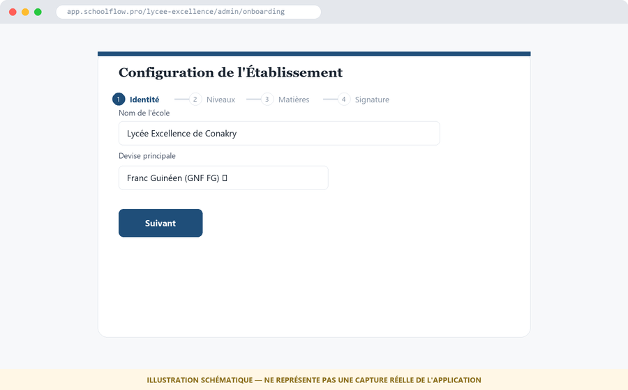
*Le fil d'Ariane (1/4) confirme qu'on est bien sur l'étape Identité. Seuls deux champs : nom de l'école et devise — pas de piège ici.*

- **Nom de l'école** — repris de l'inscription, modifiable.
- **Devise principale** — pré-remplie **Franc Guinéen (GNF FG)**, modifiable selon le pays réel de l'établissement.

### Étape 2 — Niveaux
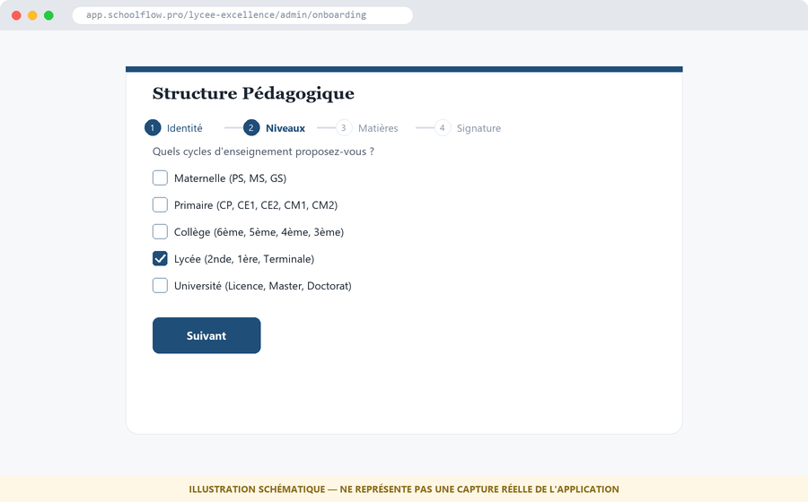
*Sur cet exemple, seul « Lycée » est coché — c'est le cycle qui crée automatiquement les niveaux 2nde/1ère/Terminale dans Structure → Niveaux. Cocher plusieurs cycles si l'établissement en héberge plusieurs.*

Question posée : « Quels cycles d'enseignement proposez-vous ? » avec des cases à cocher :
- Maternelle (PS, MS, GS)
- Primaire (CP, CE1, CE2, CM1, CM2)
- Collège (6ème, 5ème, 4ème, 3ème)
- Lycée (2nde, 1ère, Terminale)
- Université (Licence, Master, Doctorat)

**Important** : ces cases ne sont pas filtrées automatiquement par le type d'établissement choisi à l'inscription — un lycée peut par exemple cocher aussi « Collège » s'il héberge les deux cycles. Cocher **tous les cycles réellement enseignés**, même si cela dépasse le type déclaré à l'étape 1. C'est cette sélection qui **crée automatiquement les niveaux de base** dans *Structure → Niveaux* (§5.3) — un gain de temps que la configuration manuelle plus tard.

> 🎓 **Spécifique Université** — pour un établissement supérieur, cocher uniquement « Université » ; les niveaux Licence/Master/Doctorat seront ensuite affinés en Années/Niveaux dans la Structure académique.

### Étape 3 — Matières
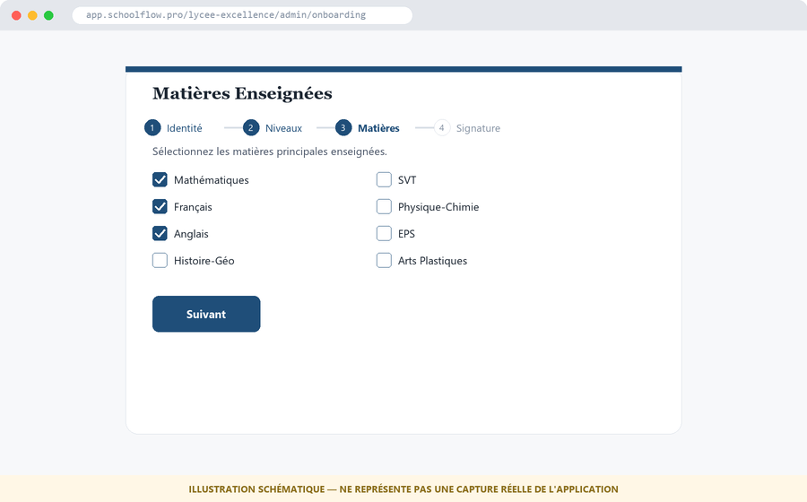
*Cocher les matières principales — inutile d'être exhaustif ici, le reste s'ajoute ensuite dans Structure → Matières une fois le socle en place.*

Sélection des matières principales parmi une liste commune (Mathématiques, Français, Anglais, Histoire-Géo, SVT, Physique-Chimie, EPS, Arts Plastiques). Comme pour les niveaux, cette sélection **pré-remplit** *Structure → Matières* — d'autres matières/UE pourront être ajoutées librement ensuite.

### Étape 4 — Signature
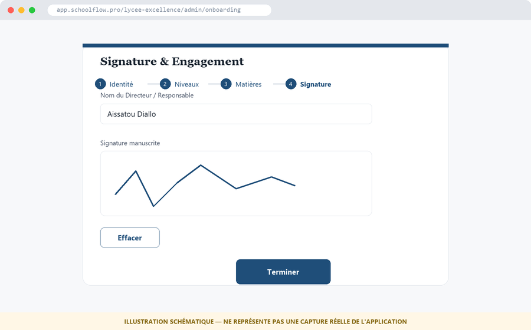
*Dernière étape avant le tableau de bord. Le bouton Terminer ne s'active qu'une fois le nom renseigné et un tracé présent dans la zone de signature.*

1. **Nom du Directeur / Responsable** — texte libre.
2. **Signature manuscrite** — à tracer à la souris (ou au doigt sur tablette/mobile) dans la zone dédiée. Bouton **Effacer** pour recommencer.
3. Cliquer **Terminer**.

À la validation :
- La signature est stockée de façon sécurisée (stockage fichiers de la plateforme).
- L'onboarding est marqué **terminé** — il ne réapparaîtra plus aux connexions suivantes.
- Redirection automatique vers le **tableau de bord** (§4).

---

## 4. Le tableau de bord

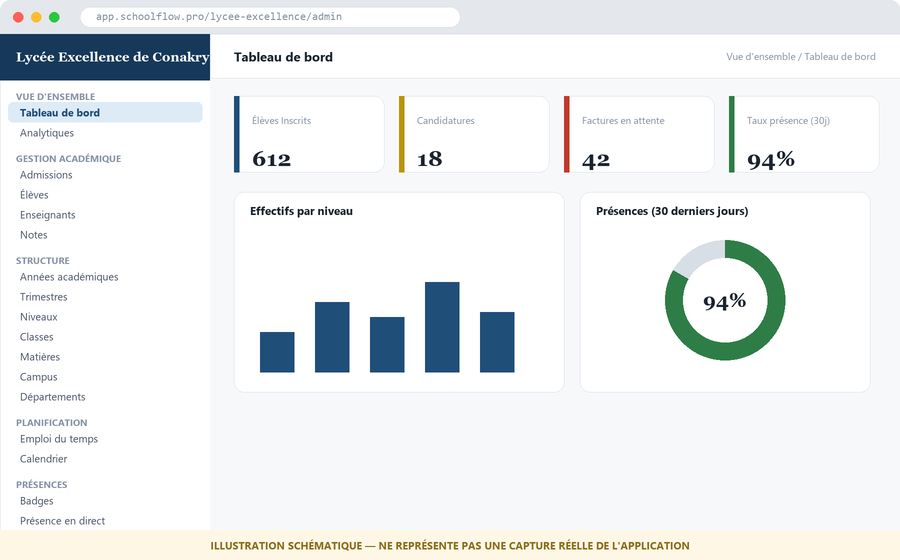
*Le menu latéral (à gauche) est la carte de navigation de tout ce guide : chaque section du sommaire correspond à un groupe de liens ici, dans le même ordre.*

C'est la page d'accueil de l'espace admin (`/{slug}/admin`). Elle affiche :
- Un message de bienvenue personnalisé.
- Des cartes chiffrées : élèves/étudiants inscrits, candidatures en attente, factures en attente, année scolaire courante, taux de présence, moyenne générale.
- Des graphiques : effectifs par niveau, répartition des présences, moyennes par classe.
- Un bloc **« Réussite Académique »** (analyse IA) et **« Sécurité Système »**.
- Des **actions rapides** : Admissions, Élèves, Notes, Finances.
- Tant qu'aucune année scolaire n'est définie comme courante, un bandeau **« Configurez votre année scolaire »** invite à commencer par le point suivant (§5.1) — c'est le tout premier réflexe après l'onboarding.

Le menu latéral gauche est organisé en sections, dans **exactement** cet ordre — c'est cet ordre que ce guide suit du §5 au §13 :

**Vue d'ensemble** · **Guides** · **Gestion Académique** (Admissions, Élèves, Listes, Inscriptions, Enseignants, Notes, Bulletins, Certificats, Scan) · **Structure** (Années → Trimestres → Niveaux → Classes → Matières → Campus → Départements) · **Planification** · **Présences** · **Finances** · **Apprentissage** · **Vie Étudiante** · **Communication** · **Administration**.

> Note : dans le menu, la section « Structure » regroupe la configuration de base, tandis que « Gestion Académique » (juste au-dessus) regroupe les usages quotidiens (élèves, notes...). **Il faut impérativement terminer toute la section Structure avant d'utiliser Gestion Académique** — c'est l'objet du §5.

---

## 5. Structure académique — l'ordre hiérarchique à respecter

C'est **la partie la plus importante de ce guide**. Chaque élément dépend du précédent ; les configurer dans le désordre provoque des listes vides ou des erreurs (ex. impossible de créer une classe sans niveau, impossible de créer un niveau sans année académique active).

```
1. Année académique  (fondation — tout en dépend)
        │
2. Trimestres / Semestres  (découpent l'année)
        │
3. Niveaux  (Terme scolaire) / Niveaux-Année  (Université)
        │
4. Classes  (Terme scolaire) / Groupes-Amphis  (Université)
        │
5. Matières  (Terme scolaire) / Unités d'Enseignement — UE  (Université)
        │
6. Campus  (sites physiques, optionnel — multi-sites)
        │
7. Départements  (unités organisationnelles, surtout Université)
```

### 5.1 Années académiques
Menu : *Structure → Années académiques*

C'est la **fondation absolue** de toute la plateforme : présences, notes, factures, emplois du temps — tout est rattaché à une année académique. Sans année académique **active/courante**, la plupart des autres écrans restent vides ou bloqués.

**Étapes :**
1. Créer une nouvelle année (ex. « 2026-2027 »), avec dates de début et de fin.
2. La marquer comme **année courante** — c'est elle qui apparaît par défaut partout dans l'application.
3. Une seule année peut être courante à la fois.

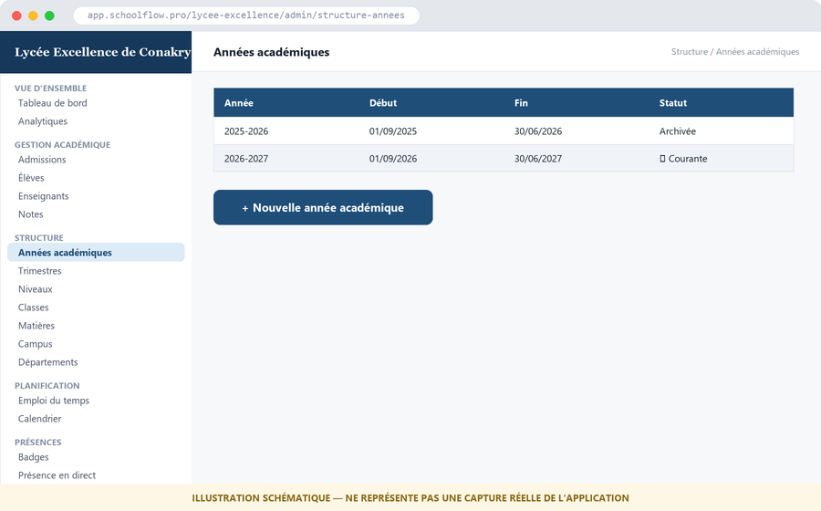
*« 2026-2027 » est marquée ★ Courante — c'est elle qui sera utilisée par défaut partout (présences, notes, factures). L'année 2025-2026 reste consultable mais archivée.*

> 🎓 **Spécifique Université** — la logique est identique ; une « année académique » université correspond en général à une année universitaire (ex. « 2026-2027 »), qui sera ensuite subdivisée en semestres plutôt qu'en trimestres.

### 5.2 Trimestres / Semestres
Menu : *Structure → Trimestres* (libellé affiché : **Trimestres** en scolaire, **Semestres** en université)

Découpe l'année académique active en périodes d'évaluation. **Prérequis : une année académique doit exister.**

- Établissement scolaire : généralement 3 trimestres (Trimestre 1, 2, 3).
- Université : généralement 2 semestres (Semestre 1, Semestre 2).

Chaque période a une date de début et de fin, utilisées ensuite pour le calcul des moyennes et la génération des bulletins.

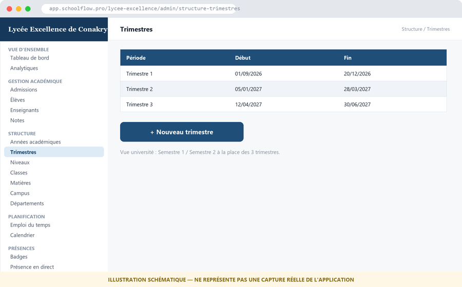
*3 trimestres couvrant toute l'année courante, sans trou ni chevauchement de dates — condition nécessaire pour que les bulletins se génèrent correctement.*

### 5.3 Niveaux
Menu : *Structure → Niveaux* (libellé affiché : **Niveau** en scolaire, **Niveau / Année** en université)

Les niveaux cochés à l'étape 2 de l'onboarding (§3) apparaissent ici pré-créés. C'est ici qu'on les affine :

- Établissement scolaire : ex. CP, CE1, 6ème, 5ème, 2nde, 1ère, Terminale — un niveau par palier de la scolarité.
- Université : ex. Licence 1, Licence 2, Licence 3, Master 1, Master 2 — un niveau par année de cursus.

**Prérequis : une année académique active.** Chaque niveau créé ici devient ensuite disponible pour créer des classes/groupes.

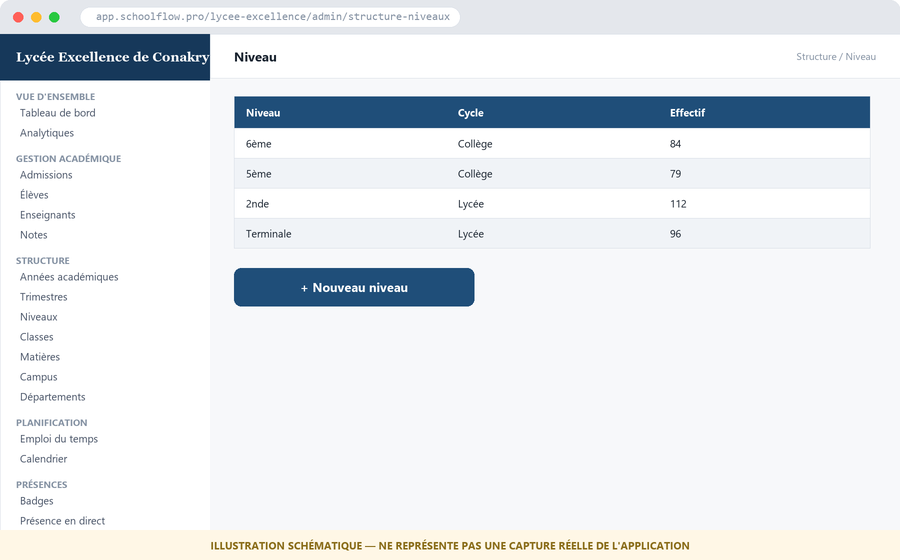
*Ces niveaux (6ème, 5ème, 2nde, Terminale) proviennent directement du cycle « Lycée »/« Collège » coché à l'onboarding — l'effectif de chacun s'affiche une fois les élèves inscrits (§6).*

### 5.4 Classes / Groupes
Menu : *Structure → Classes* (libellé affiché : **Classe** en scolaire, **Groupe / Amphi** en université)

**Prérequis : au moins un niveau créé (§5.3).** Une classe/groupe est toujours rattachée à un niveau précis.

- Établissement scolaire : ex. « 6ème A », « Terminale D » — l'unité dans laquelle les élèves sont physiquement regroupés au quotidien.
- Université : ex. « Licence 3 Info — Groupe A », « Amphi Droit L1 » — peut regrouper un effectif bien plus large qu'une classe scolaire.

C'est dans cette classe/groupe que les élèves/étudiants seront ensuite inscrits (voir *Gestion Académique → Inscriptions*, §6).

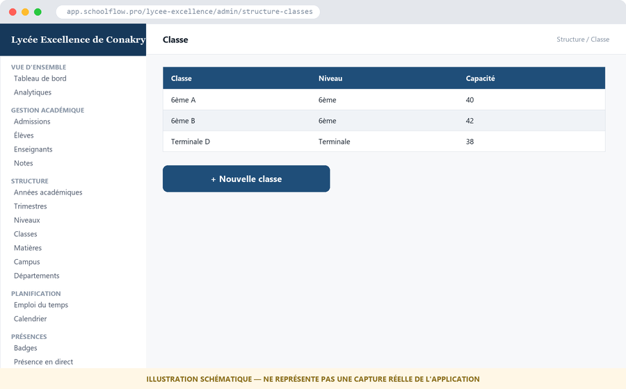
*Chaque classe est explicitement rattachée à un niveau existant (colonne « Niveau ») — impossible de créer « 6ème A » avant que le niveau « 6ème » lui-même existe.*

### 5.5 Matières / Unités d'Enseignement (UE)
Menu : *Structure → Matières* (libellé affiché : **Matières** en scolaire, **Modules / UE** en université)

Les matières cochées à l'étape 3 de l'onboarding (§3) sont pré-créées ; on peut en ajouter d'autres ici. Chaque matière/UE peut se voir attribuer :

- Un **coefficient** (établissement scolaire) — utilisé pour pondérer les moyennes.
- Des **crédits ECTS** (université) — utilisés pour valider les semestres.
- Un ou plusieurs **enseignants** référents (rattachés ensuite dans *Gestion Académique → Enseignants*, §6).

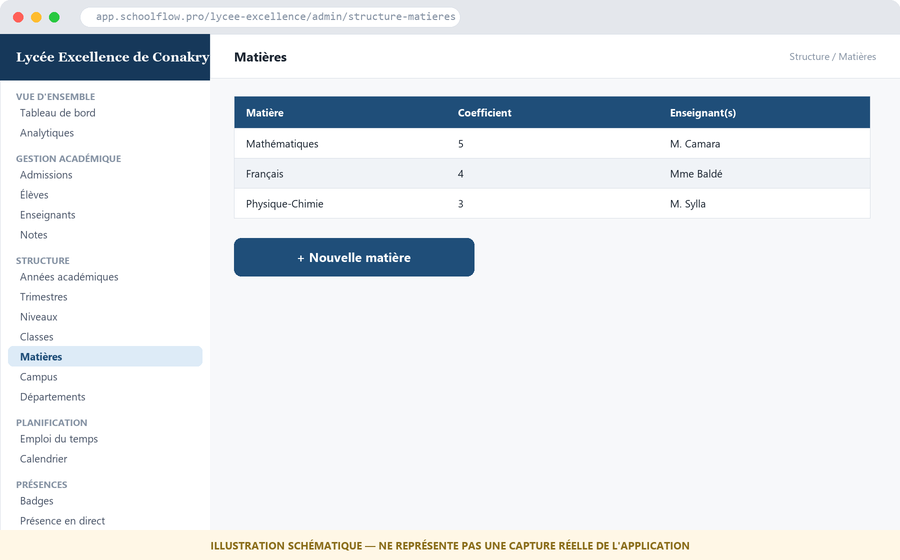
*Le coefficient (colonne du milieu) pondère la moyenne générale de l'élève — une matière à coefficient 5 pèse plus lourd qu'une matière à coefficient 1.*

### 5.6 Campus
Menu : *Structure → Campus*

**Optionnel**, à utiliser uniquement si l'établissement possède **plusieurs sites physiques** (ex. un lycée avec un campus principal et une annexe, ou une université avec plusieurs facultés géographiques). Chaque campus déclaré peut ensuite être associé à des classes/groupes et à des salles (voir *Planification → Réservations*, §7), pour distinguer l'emploi du temps et les ressources par site.

Si l'établissement n'a qu'un seul site, cette section peut être laissée vide — la plateforme fonctionne parfaitement avec un campus implicite unique.


*Exemple à deux sites : le nombre de classes rattachées à chaque campus permet de vérifier en un coup d'œil qu'aucune classe n'a été oubliée lors de la répartition.*

### 5.7 Départements
Menu : *Structure → Départements*

Unités organisationnelles internes, transversales aux niveaux/classes.

> 🎓 **Spécifique Université** — c'est ici que la notion prend tout son sens : Département d'Informatique, Département de Droit, Département de Médecine, etc. Chaque enseignant et chaque UE peut être rattaché à un département, ce qui structure ensuite les rapports et l'organisation administrative.

Pour un établissement scolaire, cette section reste utilisable mais est le plus souvent laissée de côté, ou utilisée pour regrouper les enseignants par discipline (ex. « Département Scientifique », « Département Littéraire ») si l'établissement le souhaite.

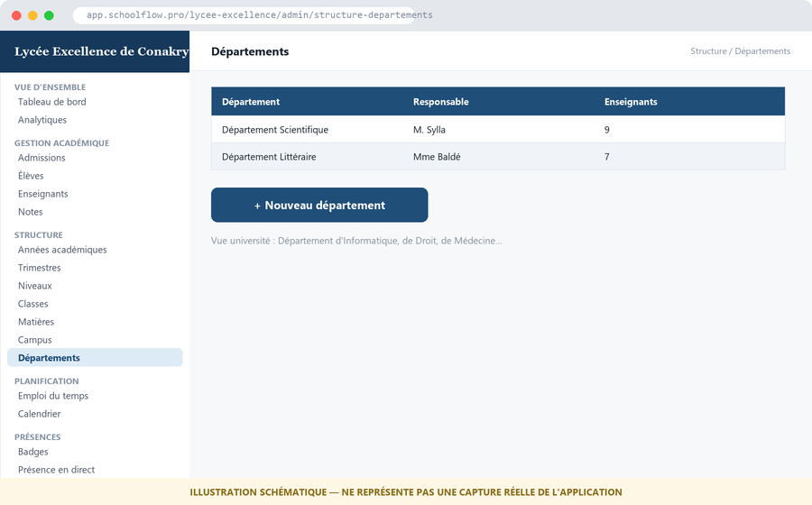
*Chaque département a un responsable désigné et un nombre d'enseignants rattachés — utile pour la répartition des rapports et de la charge administrative.*

---

**✅ Une fois les 7 points de cette section configurés dans l'ordre, la Structure académique est complète.** Toutes les fonctionnalités du menu *Gestion Académique* (§6) deviennent alors pleinement utilisables.

---

## 6. Gestion académique quotidienne

Menu : section **Gestion Académique**, au-dessus de Structure dans le menu latéral. **Prérequis : Structure académique complète (§5).**

Ordre logique d'usage recommandé :

1. **Admissions** — enregistrer et traiter les candidatures entrantes (avant l'inscription définitive).
2. **Élèves / Étudiants** (`StudentsLabel`) — fiche de chaque apprenant : identité, contacts, parent(s)/tuteur(s), documents.
3. **Listes de Classe / Listes d'Inscriptions** — vue consolidée des effectifs par classe/groupe.
4. **Inscriptions** — rattacher formellement un élève/étudiant à une classe/groupe pour l'année académique courante. C'est cette étape qui fait apparaître l'apprenant dans les listes, les présences et les bulletins.
5. **Enseignants** — fiches enseignants, rattachement aux matières/UE et aux classes/groupes qu'ils encadrent.
6. **Notes** — saisie des notes par matière/UE et par période (trimestre/semestre).
7. **Bulletins** — génération automatique à partir des notes saisies, au format PDF.
8. **Certificats** — génération de certificats de scolarité et autres attestations.
9. **Scan Présence** — présence rapide par scan de badge/QR code (voir aussi §8).

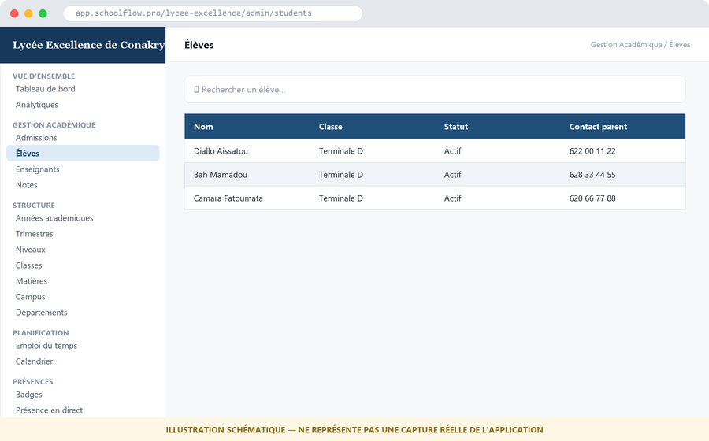
*Le filtre par classe (en haut à droite) permet de retrouver rapidement un effectif précis plutôt que de parcourir tout l'établissement.*

---

## 7. Planification

Menu : section **Planification**.

1. **Emploi du temps** — construction des créneaux hebdomadaires par classe/groupe, matière/UE et enseignant. Prérequis : Structure académique complète + enseignants rattachés.
2. **Calendrier** — événements et jours fériés/non travaillés, généralement configuré au niveau de l'établissement (visible par tous).
3. **Réservations** — réservation de salles/ressources (amphis, laboratoires, terrains de sport), utile en complément des Campus (§5.6) si plusieurs sites/salles existent.
4. **Événements** — événements ponctuels (réunions parents-professeurs, sorties, cérémonies).

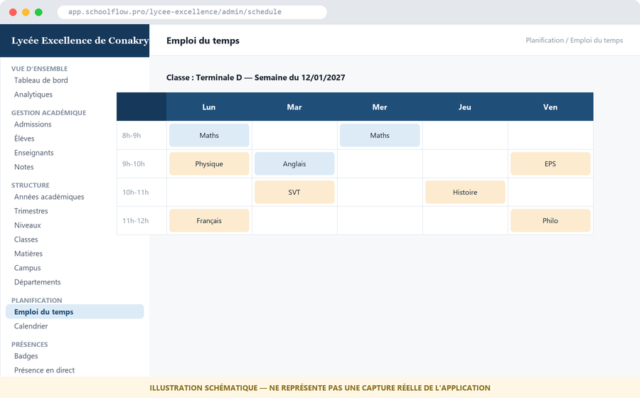
*Grille hebdomadaire classique : jours en colonnes, créneaux horaires en lignes. Chaque case affiche la matière ; enseignant et salle apparaissent au clic.*

---

## 8. Présences

Menu : section **Présences**.

1. **Badges** — génération/gestion des badges (QR code) élèves/étudiants et enseignants, pour le pointage.
2. **Présence en direct** — tableau de bord temps réel des présences du jour, par classe/groupe.
3. **Heures Enseignants** — suivi des heures effectuées par les enseignants (utile pour la paie et le pilotage RH, en lien avec §13).

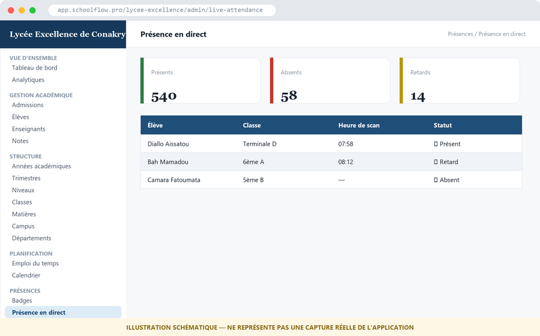
*Les 3 compteurs (Présents / Absents / Retards) se mettent à jour en temps réel à mesure que les scans de badge arrivent dans la journée.*

---

## 9. Finances

Menu : section **Finances**.

1. **Finances** (frais, factures, paiements) — définir les types de frais (inscription, mensualité, cantine...), en **GNF** ou devise locale (voir §3, étape Identité). Émettre des factures, encaisser les paiements, imprimer les reçus PDF.
2. **Inventaire** — suivi du matériel/stock de l'établissement.
3. **Réception Commandes** — réception des commandes fournisseurs liées à l'inventaire.
4. **Exports Comptables** — export des données financières pour la comptabilité externe.

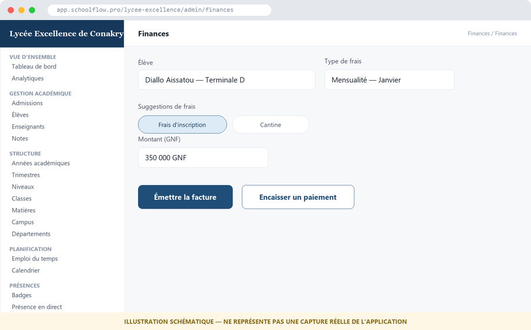
*Les « suggestions de frais » (pastilles cliquables) évitent de ressaisir le libellé et le montant à chaque facture — utile pour les frais récurrents comme la mensualité.*

---

## 10. Apprentissage

Menu : section **Apprentissage** (certains modules marqués **Bêta**).

- **E-learning** *(Bêta)* — cours en ligne, ressources pédagogiques numériques.
- **Bibliothèque** — gestion des ouvrages physiques/numériques et des emprunts.
- **Marketplace Éducatif** *(Bêta)* — place de marché de ressources pédagogiques.
- **Gamification** *(Bêta)* — badges de réussite et mécaniques de motivation pour les apprenants.

> Les modules marqués Bêta sont fonctionnels mais en amélioration continue — à présenter avec cette précision lors d'une formation client (voir aussi le script de démonstration, Annexe B).

---

## 11. Vie étudiante

Menu : section **Vie Étudiante** (modules majoritairement **Bêta**).

- **Clubs** *(Bêta)* — clubs et activités extrascolaires/parascolaires.
- **Carrières & Stages** *(Bêta)* — offres de stages et suivi de l'insertion professionnelle.
- **Mentors Alumni** *(Bêta)* — mise en relation anciens élèves/étudiants ↔ apprenants actuels.
- **Requêtes Alumni** *(Bêta)* — demandes émanant des anciens (attestations, mise à jour de coordonnées...).

> 🎓 **Spécifique Université** — cette section est en pratique surtout pertinente pour l'enseignement supérieur (réseau alumni, stages professionnels), mais reste accessible à tous les types d'établissement.

---

## 12. Communication

Menu : section **Communication**.

1. **Messages** — messagerie interne entre administration, enseignants, élèves/étudiants et parents.
2. **Annonces** — diffusion d'annonces générales à toute la communauté ou à un public ciblé (ex. une classe, un niveau).

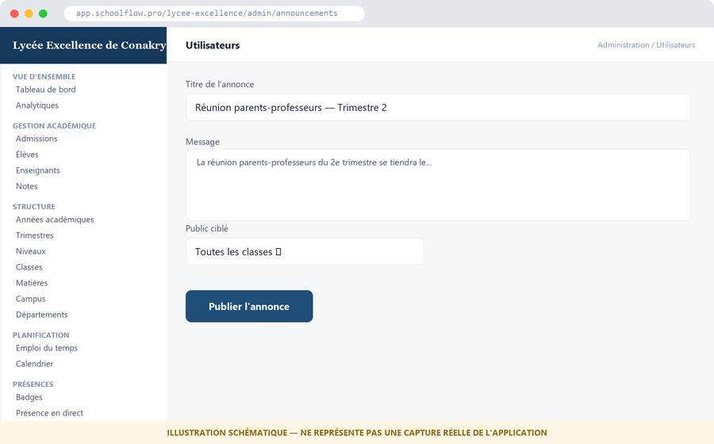
*Le champ « Public ciblé » permet de restreindre l'annonce à une classe précise plutôt que de la diffuser à tout l'établissement.*

---

## 13. Administration

Menu : section **Administration** — réservée aux profils avec droits étendus.

1. **Utilisateurs** — gestion des comptes (créer, désactiver, changer de rôle) : Directeur, Chef de Département, Enseignant, Élève/Étudiant, Parent, Personnel, Comptable, Secrétaire...
2. **Ressources Humaines** — dossiers du personnel, contrats, congés, fiches de paie.
3. **Sécurité** — paramètres de sécurité du compte établissement (politique de mot de passe, sessions actives, MFA).
4. **Exports** — export de données (élèves, notes...) au format standard.
5. **Import de données** — import en masse (ex. import CSV d'une liste d'élèves existante).
6. **Journal d'audit** — historique des actions sensibles effectuées sur la plateforme, à des fins de traçabilité.
7. **Qualité des Données** — détection d'incohérences (doublons, champs manquants).
8. **Pages publiques** — personnalisation des pages publiques de l'établissement (vitrine, contact, admissions en ligne).
9. **Paramètres** — réglages généraux : logo, couleurs, langue par défaut, position du menu, et tout ce qui n'a pas été figé à l'inscription (y compris, avec précaution, le type d'établissement).

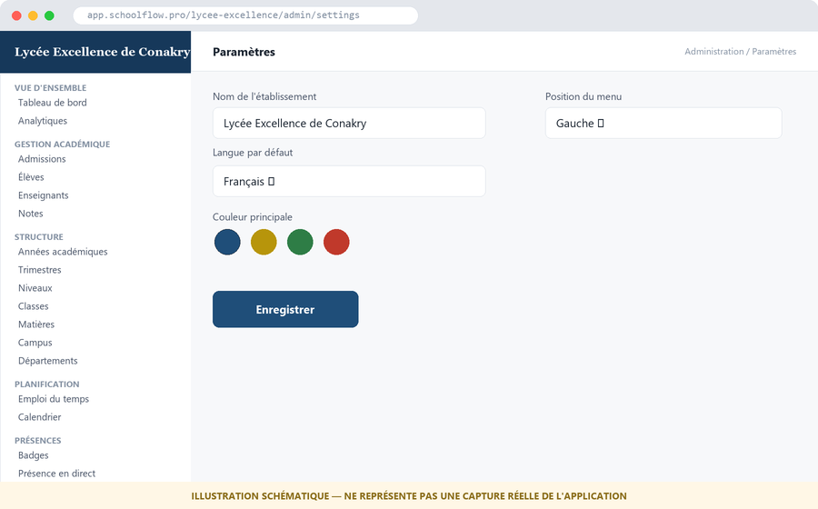
*La couleur principale choisie ici se répercute automatiquement sur l'ensemble de l'interface (boutons, en-têtes) — pas besoin de la redéfinir ailleurs.*

---

## 14. Checklist de mise en route par type d'établissement

### École primaire / Collège / Lycée / Centre de formation
- [ ] Inscription (§2) avec le bon type d'établissement
- [ ] Onboarding complet (§3) : identité, cycles cochés, matières, signature
- [ ] Année académique créée et marquée courante (§5.1)
- [ ] 3 trimestres créés (§5.2)
- [ ] Niveaux vérifiés/complétés (§5.3)
- [ ] Classes créées pour chaque niveau (§5.4)
- [ ] Matières + coefficients définis (§5.5)
- [ ] Campus déclaré si plusieurs sites (§5.6)
- [ ] Élèves inscrits dans leurs classes (§6)
- [ ] Enseignants créés et rattachés aux matières/classes (§6)
- [ ] Emploi du temps construit (§7)
- [ ] Frais scolaires configurés en GNF (§9)

### Université / Grandes écoles
- [ ] Inscription (§2) avec le type « Université / Grandes écoles »
- [ ] Onboarding complet (§3) : cycle « Université » coché
- [ ] Année académique créée et marquée courante (§5.1)
- [ ] 2 semestres créés (§5.2)
- [ ] Niveaux/Années créés (L1, L2, L3, M1, M2...) (§5.3)
- [ ] Groupes/Amphis créés par niveau (§5.4)
- [ ] UE/Modules + crédits ECTS définis (§5.5)
- [ ] Campus déclaré si plusieurs facultés/sites (§5.6)
- [ ] Départements créés (Informatique, Droit, Médecine...) (§5.7)
- [ ] Étudiants inscrits dans leurs groupes (§6)
- [ ] Enseignants rattachés aux UE et départements (§6, §5.7)
- [ ] Emploi du temps construit (§7)
- [ ] Frais universitaires configurés (§9)

---

## Annexes

### Annexe A — Glossaire terminologie scolaire ↔ université

| Concept | Terme scolaire | Terme université |
|---|---|---|
| Période d'évaluation | Trimestre | Semestre |
| Unité de contenu | Matière | Unité d'Enseignement (UE) / Module |
| Palier de progression | Niveau | Niveau / Année |
| Groupe d'apprenants | Classe | Groupe / Amphi |
| Apprenant | Élève | Étudiant |
| Pondération | Coefficient | Crédits (ECTS) |

### Annexe B — Pour aller plus loin
- [`docs/DEMO_SCRIPT.md`](../DEMO_SCRIPT.md) — trame de démonstration commerciale de 20 minutes, utile comme complément pédagogique court après ce guide complet.
- [`docs/user-guides/`](../user-guides/) — fiches courtes existantes (années académiques, classes/salles, emploi du temps, comptes élèves).

### Annexe C — Remplacer les illustrations par de vraies captures d'écran
Les 19 images de ce guide sont des schémas illustratifs (`docs/formation/screenshots/01-*.png` à `19-*.png`, générés par `docs/formation/build_illustrations_pil.py` — variantes SVG dans les mêmes fichiers `.svg`, générées par `build_illustrations.py`). Pour les remplacer par de vraies captures :
1. Se connecter à un établissement de démonstration (idéalement un de type scolaire et un de type université, pour illustrer les variantes).
2. Naviguer jusqu'à l'écran correspondant (le titre de chaque image dans ce guide indique l'écran exact).
3. Faire une capture d'écran pleine page (desktop, 1280×800 recommandé pour la cohérence du document).
4. Remplacer le fichier `docs/formation/screenshots/NN-nom.png` correspondant par la vraie capture, en conservant exactement le même nom de fichier — aucune modification du texte du guide n'est alors nécessaire.
